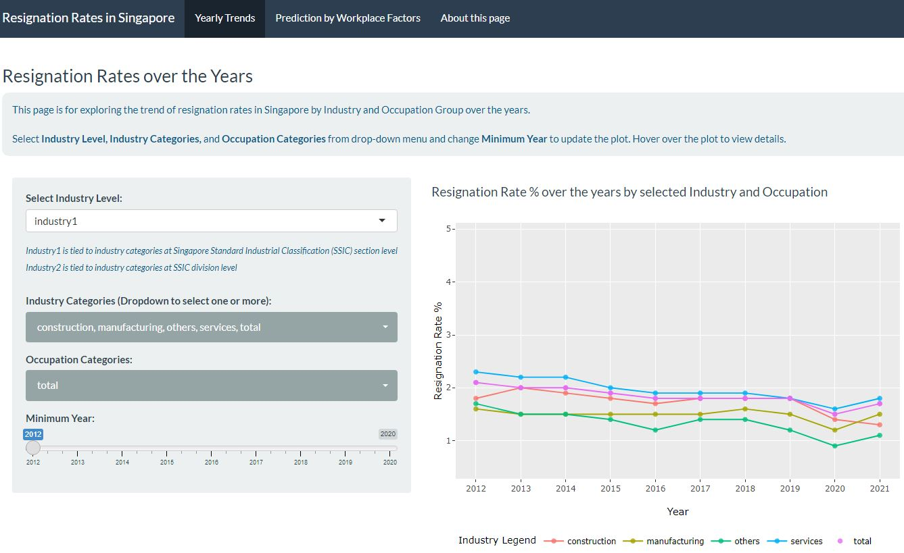
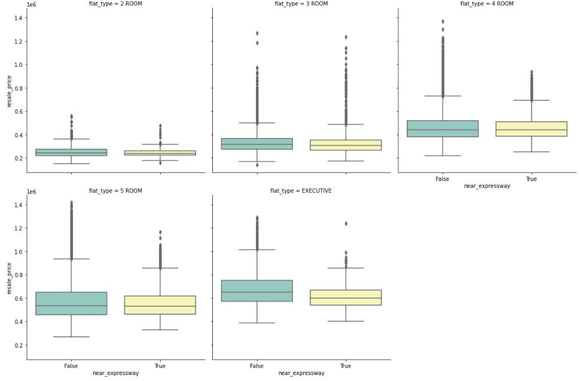
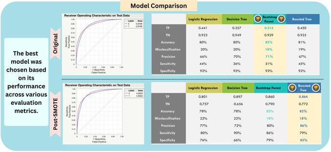

## Portfolio

---
### Analysis of Resignation Rates in Singapore

  An Rshiny App for exploration of the resignation rates in Singapore over the years, across industries and occupations, as well as in relation to other workplace factors like Median Monthly Income, Average Weekly Hours Worked and Proportion of Flexible Work Arrangement.

 

---
### Analysis of Proximity to Expressway and HDB Resale Prices in Singapore

  An analysis of whether proximity of the HDB to the expressway has a relationship with HDB resale prices. Statistical analysis found that the mean HDB resale prices were lower for HDBs near expressway compared to HDBs not near expressway, for 2-room, 3-room, 4-room, 5-room and executive HDBs.

 

---
### Case Study in Hong Kong: Landslide Susceptibility Prediction

  A case study in Hong Kong to understand the efficacy of different classifier methods on detecting landslide susceptibility based on terrain information. To address the issue of imbalanced data, synthetic minority oversampling technique (SMOTE) was applied to expand the quantity of landslide samples. Results indicated that across all models, the usage of balanced data have led to improved outcomes, with recursive partitioning approaches like Bootstrap Forest and Boosted Tree generally performed better compared to logistic regression.

 

 # link to image

---

© 2022 Fong Bao Xian. Powered by Jekyll and the Minimal Theme.

