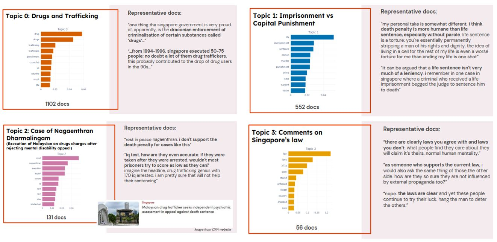
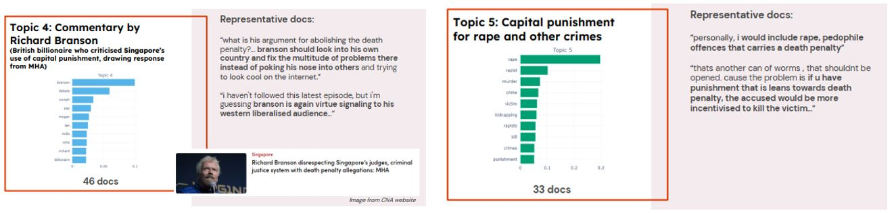
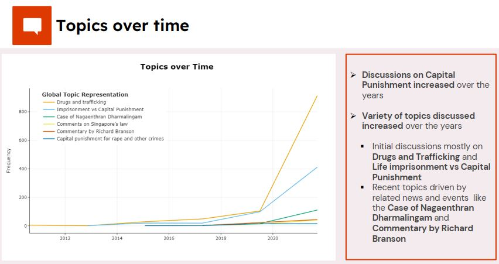
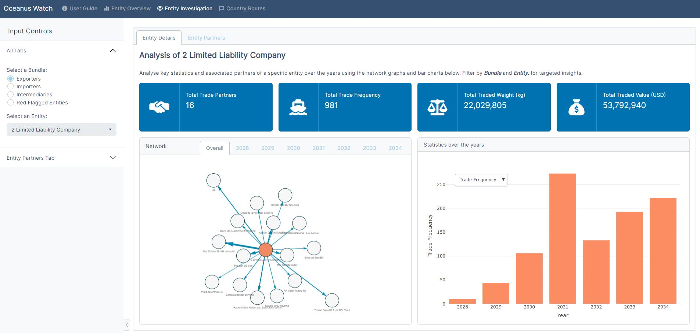
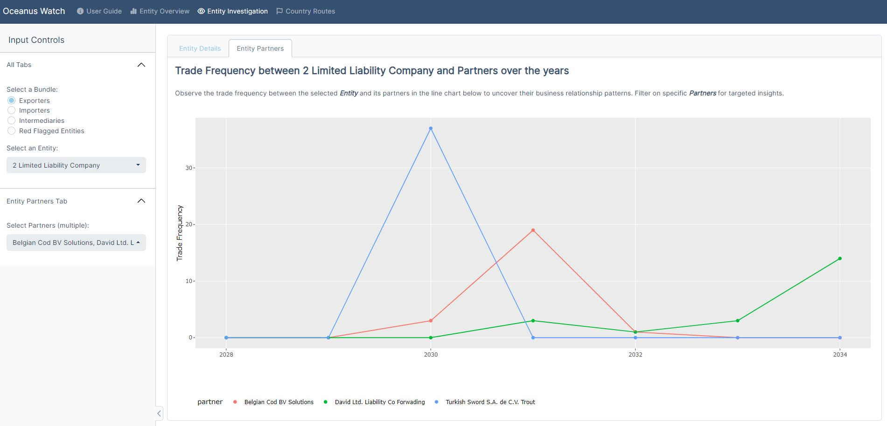
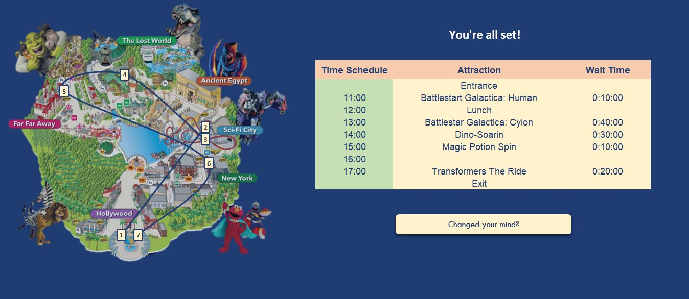

## Portfolio

---
### Topic Modeling for Understanding Key Discussions on Capital Punishment in the Singapore Reddit Community

  This project was conducted for understanding the sentiments and key discussions relating to capital punishment in the Singapore Reddit community. Posts and comments related to capital punishment were extracted from r/askSingapore, r/Singapore and r/SingaporeRaw subreddits using the Reddit Application Programming Interface (API). Then, topic modeling using BERTopic discovered six key themes and discussions surrounding capital punishment. The occurrence of topics over time was also visualised to understand how topics have changed over time.

 

---
### Network Analysis for Identification of Fishing Companies with Illegal Activities

  This project based on [Vast Challenge 2023](https://vast-challenge.github.io/2023/MC2.html) involved the use of visual analytics to help identify companies possibly engaged in illegal, unreported, and unregulated (IUU) fishing. An RShiny App was built to help users explore and interact with different types of network and shipment data to identify irregular trends and patterns.

 

---
### Analysis of Proximity to Expressway and HDB Resale Prices in Singapore

  An analysis of whether proximity of the HDB to the expressway has a relationship with HDB resale prices. Statistical analysis found that the mean HDB resale prices were lower for HDBs near expressway compared to HDBs not near expressway, for 2-room, 3-room, 4-room, 5-room and executive HDBs.

 

---
### Analysis of Resignation Rates in Singapore

  An Rshiny App for exploration of the resignation rates in Singapore over the years, across industries and occupations, as well as in relation to other workplace factors like Median Monthly Income, Average Weekly Hours Worked and Proportion of Flexible Work Arrangement.

 

---
### Optimisation of Visitor Experience at Universal Studios Singapore

  An Excel model was built with the aim of maximising visitors' experience at the Universal Studios Singapore (USS) by minimising their total queue and travel time between rides. The model takes in inputs like day of visit, time of visit and ride preferences etc. and returns the optimised itinerary for the visitor.
  
  For building the model, real-time queue time and distances between rides were first collected to simulate and generate the average queue time and travel time between rides. Then, solver and permutation lookup methods were used to generate the optimised itinerary for the visitor. Macros were also used to build the user interface for the model.

 

---
### Case Study on Landslide Susceptibility Prediction in Hong Kong

  A case study for predicting landslide susceptibility based on terrain information in Hong Kong. To address the issue of imbalanced data, synthetic minority oversampling technique (SMOTE) was applied to expand the quantity of landslide samples. Results indicated that across all models, the usage of balanced data have led to improved outcomes, with recursive partitioning approaches like Bootstrap Forest and Boosted Tree generally performing better compared to logistic regression.

 

---

© 2022 Fong Bao Xian. Powered by Jekyll and the Minimal Theme.

